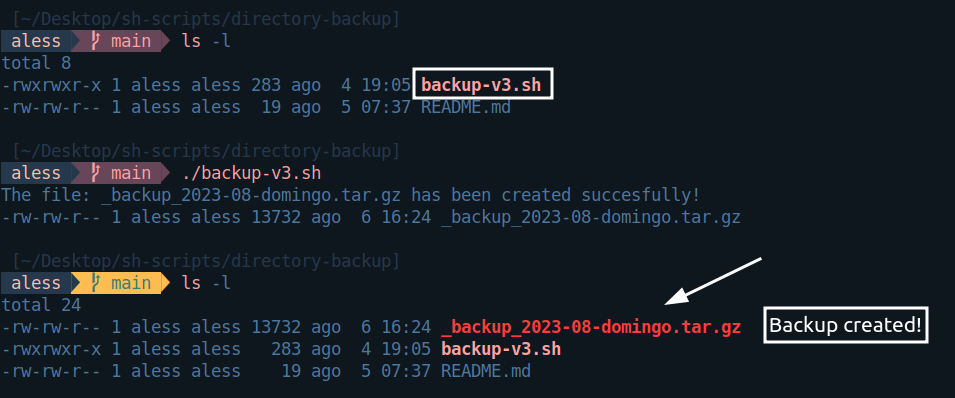

# Directory-Backup

> Warning: This only works on **linux**

This small but incredible script will save the **content** whether files, directories and sub-directories in a `tar` compressed file as a backup so you'll not worry about making an entire backup *all by yourself*

As a demonstration: ⬇⬇⬇

---
## Steps

1. `Clone` this repository in your directory or folder where you want to create the **backup**

```
# SSH link
git clone git@github.com:The-BoxHead-Guy/Directory-Backup.git .

# HTTP link
git clone https://github.com/The-BoxHead-Guy/Directory-Backup.git .
```

2. `Activate` the script by writing in the console

```
./backup-v3.sh
```

It will create automatically the corresponding **backup** of your entire directory.

---
That's it!

If you have any suggestion about the improvement of this backup, do not doubt letting me know it. **Enjoy it!**
